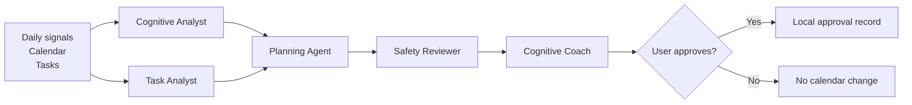

# 🧠 NeuroPilot

### An AI agent that optimizes cognitive energy, not just time.

Most calendars optimize availability. NeuroPilot prototypes a different question: **when is a particular kind of thinking most likely to be well matched to the person’s available cognitive resources?**

It is a local-first, human-in-the-loop MVP for high-cognitive-load work. The demo forecasts four non-medical productivity signals—executive, attention, creative, and social capacity—then matches tasks to open calendar slots and explains every recommendation.

> **Scientific boundary:** NeuroPilot does not measure brain regions, diagnose fatigue, or make medical claims. Its cognitive dimensions are transparent product signals used to rank work slots.

## What is included

- **LangGraph workflow:** cognitive analyst and task analyst run in parallel, followed by planning, review/retry, coaching, and an explicit approval checkpoint.
- **Explainable cognitive forecast:** half-hour capacity and fatigue estimates from chronotype, sleep, self-reports, exercise, prior deep work, and meeting load.
- **Task understanding:** deterministic offline task profiles now, with provider-neutral prompts and schema ready for an LLM adapter later.
- **Constraint-aware planner:** respects calendar blocks, duration, priority, deadlines, preferences, fatigue, and context switching.
- **Human control:** approving a plan records a local decision only; this MVP never changes an external calendar.
- **Polished demo:** Cognitive dashboard, daily schedule, recovery notes, and an agent decision trace.

## Demo flow



## Quick start

Requires Python 3.11+.

```powershell
python -m venv .venv
.\.venv\Scripts\Activate.ps1
pip install -e ".[dev]"
uvicorn app.main:app --app-dir backend --reload
```

Open [http://localhost:8000](http://localhost:8000). Interactive API documentation is available at [http://localhost:8000/docs](http://localhost:8000/docs). These URLs are available only on the computer running the server.

If PowerShell does not expose `python`, use the Python executable installed on your machine or your preferred environment manager.

## Production deployment

`render.yaml` defines a free Render web service. Render exposes a public HTTPS URL and redeploys when `main` changes. The free tier can sleep after inactivity and its local SQLite run history is ephemeral; choose a paid instance plus persistent storage before relying on it for real user data.

### Cloudflare Pages (recommended public demo)

The `frontend/` directory is also a fully static version of the demo. Its cognitive forecast, scheduling and approval state run in the visitor's browser, so no user input is sent to a server. This is the recommended free public portfolio deployment.

In Cloudflare Pages, connect this GitHub repository and use:

| Setting | Value |
| --- | --- |
| Framework preset | None |
| Build command | `exit 0` |
| Build output directory | `frontend` |
| Production branch | `main` |

Cloudflare will provide a `*.pages.dev` URL and redeploy it automatically after each push to `main`.

## Test

```powershell
.\.venv\Scripts\python.exe -m pytest -q
```

## Architecture

| Layer | Choice | Why |
| --- | --- | --- |
| Workflow | LangGraph | Explicit state, traceable nodes, conditional retry |
| API | FastAPI + Pydantic | Typed request/response contract and built-in OpenAPI docs |
| Forecast | Explainable parameterized model | Runs offline; avoids unsubstantiated “brain scan” claims |
| Planning | Deterministic constrained optimizer | Auditable scores and reproducible recommendations |
| Persistence | SQLite | Local-first run and approval history |
| UI | Vanilla HTML/CSS/JS | No build step; starts with the backend |

Read the full [architecture notes](docs/architecture.md).

## API surface

| Method | Endpoint | Purpose |
| --- | --- | --- |
| `GET` | `/api/demo` | Loads the founder demo scenario |
| `POST` | `/api/optimize` | Runs the full agent workflow |
| `GET` | `/api/runs/{run_id}` | Reads a prior run and trace |
| `POST` | `/api/runs/{run_id}/decision` | Records `approve` or `reject` locally |
| `GET` | `/api/health` | Service health check |

## Project structure

```text
backend/app/
├── agents/          # LangGraph nodes, coach, task analyzer, prompt contracts
├── cognitive/       # Explainable cognitive forecast
├── domain/          # Typed API/domain models
├── optimization/    # Scheduler and safety review
├── main.py          # FastAPI application
└── storage.py       # Local SQLite run history
frontend/            # Zero-build interactive dashboard
data/                # Demo scenario and ignored local database
tests/               # Forecast, workflow and API tests
```

## Next milestones

1. Replace or calibrate the forecast with consented longitudinal feedback data.
2. Add an LLM-backed task analyzer with strict structured outputs and evaluation sets.
3. Integrate a calendar provider behind the existing approval checkpoint.
4. Add user-specific memory and offline evaluation of scheduling quality.

## License

MIT
