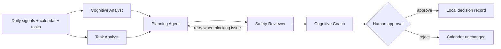

# Architecture

NeuroPilot is a human-in-the-loop scheduling system. It models **task demands** and **estimated productivity capacity** as four normalized dimensions: executive, attention, creative, and social. These are product signals for task ranking, not measurements of brain regions or medical claims.

## Agent responsibilities

| Component | Responsibility | MVP implementation |
| --- | --- | --- |
| Cognitive Analyst | Produces 30-minute capacity and fatigue forecast | Explainable parameterized model using sleep, self-report, chronotype, meeting load and time of day |
| Task Analyst | Assigns each task a cognitive-demand vector | Offline keyword rules; stable structured contract for a future LLM adapter |
| Planning Agent | Finds available slots that maximize cognitive fit | Greedy constrained optimizer with busy blocks, duration, priority, deadline, preference, fatigue and context-switch penalties |
| Safety Reviewer | Blocks overlapping / unplaced schedules and flags load risk | Deterministic constraints with one retry branch in LangGraph |
| Cognitive Coach | Turns the plan into clear user-facing guidance | Non-medical, approval-gated explanation |

## Scoring

For task demand vector $T$, predicted capacity $C$ and fatigue $F$, the ranking score is approximately:

$$
0.76\,\operatorname{fit}(T,C) + 0.20\,(1-\operatorname{deficit}(T,C)) - 0.16\,\operatorname{fatigue}(T,F) + \operatorname{constraints}
$$

The planner reserves calendar blocks, filters out missed deadlines, and only returns proposals. Approval is stored locally; no external calendar provider is called in this MVP.

## Data and privacy

- Run results and approval decisions are stored in local SQLite (`data/neuropilot.db`).
- The demo uses no API key and sends no user data to a model provider.
- A future model adapter must preserve the structured task-profile contract in `backend/app/domain/models.py` and keep the scheduler deterministic and auditable.

